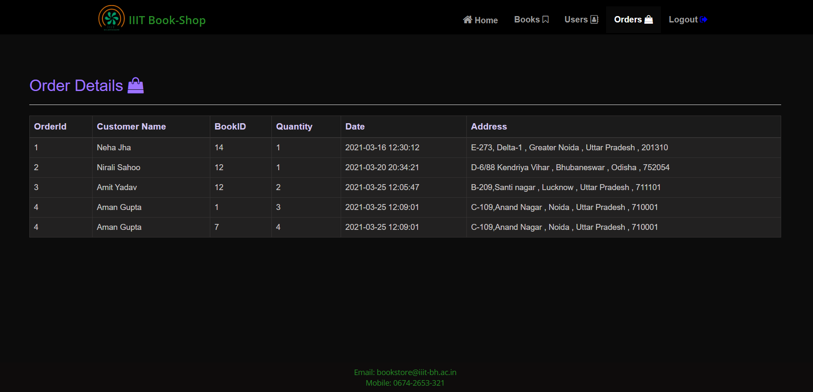

# IIIT BookStore | RDBMS Project

    
  </a>
 
## Features
* <b>Registration :</b> Create an account using username,email,phone number and password before you enter the bookstore.
* <b>Login :</b> If you have already signed up, Login using your registered credentials.
* <b>Books :</b> Books stored in the database are made available for the users to browse and buy.
* <b>BookCart :</b> Save your favorite ones in the cart to buy them anytime you want.
* <b>Admin :</b> Admin manages and maintains the bookshop. He/She can keep track of the users who register, the books that they purchase and all their details required for the book delivery. Admin can also add/view/update/delete books as per their requirement. 

## Technology Stack

- Frontend
  - HTML
  - CSS
  - Bootstrap
  - Javascript

- Backend
  - PHP 
  - MySQL (Database)

- Tools
  - Xampp
  - Git
  - Github

## Structure

### Home Page
   - 
### For Users
  - Register/Login
  - Home Page
     - 
  - Books Available
     - Display all books available in store
         - 
     - Search Particular Book with Book's Name
         - 
     - View Particular Book's Detail
  - Book-Cart
     - Add books to Cart
     - Update quantity of books and save changes
     - Buy Book
     - 
### For Admin
  - Login
  - Home Page
     - 
  - Book-Details
     - Display all books available in store
     - Add new books
     - Update Book
     - Delete Book
     - 
  - User-Details
     - Display all Users registered in store
     - View Particular User's Detail
     - Remove Particular User's account
     - 
  - Order-Details
     - Display history of all Orders.
     - 
   

####  :) Visit The Website
 > [IIIT BOOKSTORE](http://iiit-bookshop.42web.io/)
